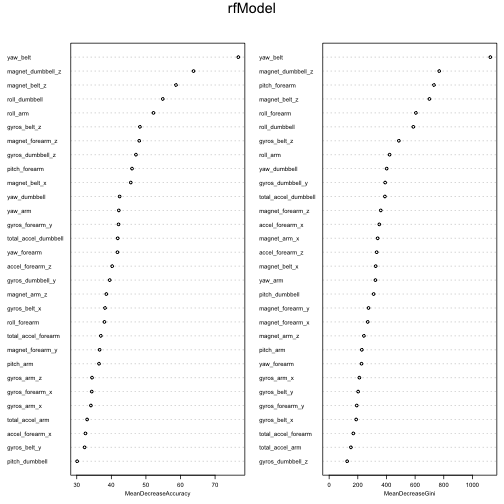

Practicle Machine learning project – Predict the wearable activities
========================================================

Introduction

Using devices such as Jawbone Up, Nike FuelBand, and Fitbit it is now possible to collect a large amount of data about personal activity relatively inexpensively. These type of devices are part of the quantified self movement – a group of enthusiasts who take measurements about themselves regularly to improve their health, to find patterns in their behavior, or because they are tech geeks. One thing that people regularly do is quantify how much of a particular activity they do, but they rarely quantify how well they do it.

In this project, the goal will be to use data from accelerometers on the belt, forearm, arm, and dumbell of 6 participants. They were asked to perform barbell lifts correctly and incorrectly in 5 different ways. More information is available from the website here: [http://groupware.les.inf.puc-rio.br/har](http://groupware.les.inf.puc-rio.br/har) (see the section on the Weight Lifting Exercise Dataset).

Data

The training data for this project are available here:

[https://d396qusza40orc.cloudfront.net/predmachlearn/pml-training.csv](https://d396qusza40orc.cloudfront.net/predmachlearn/pml-training.csv)

The test data are available here:

[https://d396qusza40orc.cloudfront.net/predmachlearn/pml-testing.csv](https://d396qusza40orc.cloudfront.net/predmachlearn/pml-testing.csv)

The data for this project come from this source: [http://groupware.les.inf.puc-rio.br/har](http://groupware.les.inf.puc-rio.br/har).

The data can be downloaded using the below R script.


```r
downloadFiles <- function(dataURL = "", destF = "t.csv") {
    if (!file.exists(destF)) {
        download.file(dataURL, destF, method = "wget")
    } else {
        message("data already downloaded.")
    }
}
```


loading training and testing dataset


```r
trainURL <- "https://d396qusza40orc.cloudfront.net/predmachlearn/pml-training.csv"
testURL <- "https://d396qusza40orc.cloudfront.net/predmachlearn/pml-testing.csv"
```


Download traninig files 

```r
downloadFiles(trainURL, "pml-training.csv")
```

```
## data already downloaded.
```


Download Test File

```r
downloadFiles(testURL, "pml-test.csv")
```

```
## data already downloaded.
```


read train and test files into R

```r
training <- read.csv("pml-training.csv", na.strings = c("NA", ""))
testing <- read.csv("pml-test.csv", na.strings = c("NA", ""))
```


First look of training data


```r
dim(training)
```

```
## [1] 19622   160
```


```r
str(training)
```

```
## 'data.frame':	19622 obs. of  160 variables:
##  $ X                       : int  1 2 3 4 5 6 7 8 9 10 ...
##  $ user_name               : Factor w/ 6 levels "adelmo","carlitos",..: 2 2 2 2 2 2 2 2 2 2 ...
##  $ raw_timestamp_part_1    : int  1323084231 1323084231 1323084231 1323084232 1323084232 1323084232 1323084232 1323084232 1323084232 1323084232 ...
##  $ raw_timestamp_part_2    : int  788290 808298 820366 120339 196328 304277 368296 440390 484323 484434 ...
##  $ cvtd_timestamp          : Factor w/ 20 levels "02/12/2011 13:32",..: 9 9 9 9 9 9 9 9 9 9 ...
##  $ new_window              : Factor w/ 2 levels "no","yes": 1 1 1 1 1 1 1 1 1 1 ...
##  $ num_window              : int  11 11 11 12 12 12 12 12 12 12 ...
##  $ roll_belt               : num  1.41 1.41 1.42 1.48 1.48 1.45 1.42 1.42 1.43 1.45 ...
##  $ pitch_belt              : num  8.07 8.07 8.07 8.05 8.07 8.06 8.09 8.13 8.16 8.17 ...
##  $ yaw_belt                : num  -94.4 -94.4 -94.4 -94.4 -94.4 -94.4 -94.4 -94.4 -94.4 -94.4 ...
##  $ total_accel_belt        : int  3 3 3 3 3 3 3 3 3 3 ...
##  $ kurtosis_roll_belt      : Factor w/ 396 levels "-0.016850","-0.021024",..: NA NA NA NA NA NA NA NA NA NA ...
##  $ kurtosis_picth_belt     : Factor w/ 316 levels "-0.021887","-0.060755",..: NA NA NA NA NA NA NA NA NA NA ...
##  $ kurtosis_yaw_belt       : Factor w/ 1 level "#DIV/0!": NA NA NA NA NA NA NA NA NA NA ...
##  $ skewness_roll_belt      : Factor w/ 394 levels "-0.003095","-0.010002",..: NA NA NA NA NA NA NA NA NA NA ...
##  $ skewness_roll_belt.1    : Factor w/ 337 levels "-0.005928","-0.005960",..: NA NA NA NA NA NA NA NA NA NA ...
##  $ skewness_yaw_belt       : Factor w/ 1 level "#DIV/0!": NA NA NA NA NA NA NA NA NA NA ...
##  $ max_roll_belt           : num  NA NA NA NA NA NA NA NA NA NA ...
##  $ max_picth_belt          : int  NA NA NA NA NA NA NA NA NA NA ...
##  $ max_yaw_belt            : Factor w/ 67 levels "-0.1","-0.2",..: NA NA NA NA NA NA NA NA NA NA ...
##  $ min_roll_belt           : num  NA NA NA NA NA NA NA NA NA NA ...
##  $ min_pitch_belt          : int  NA NA NA NA NA NA NA NA NA NA ...
##  $ min_yaw_belt            : Factor w/ 67 levels "-0.1","-0.2",..: NA NA NA NA NA NA NA NA NA NA ...
##  $ amplitude_roll_belt     : num  NA NA NA NA NA NA NA NA NA NA ...
##  $ amplitude_pitch_belt    : int  NA NA NA NA NA NA NA NA NA NA ...
##  $ amplitude_yaw_belt      : Factor w/ 3 levels "#DIV/0!","0.00",..: NA NA NA NA NA NA NA NA NA NA ...
##  $ var_total_accel_belt    : num  NA NA NA NA NA NA NA NA NA NA ...
##  $ avg_roll_belt           : num  NA NA NA NA NA NA NA NA NA NA ...
##  $ stddev_roll_belt        : num  NA NA NA NA NA NA NA NA NA NA ...
##  $ var_roll_belt           : num  NA NA NA NA NA NA NA NA NA NA ...
##  $ avg_pitch_belt          : num  NA NA NA NA NA NA NA NA NA NA ...
##  $ stddev_pitch_belt       : num  NA NA NA NA NA NA NA NA NA NA ...
##  $ var_pitch_belt          : num  NA NA NA NA NA NA NA NA NA NA ...
##  $ avg_yaw_belt            : num  NA NA NA NA NA NA NA NA NA NA ...
##  $ stddev_yaw_belt         : num  NA NA NA NA NA NA NA NA NA NA ...
##  $ var_yaw_belt            : num  NA NA NA NA NA NA NA NA NA NA ...
##  $ gyros_belt_x            : num  0 0.02 0 0.02 0.02 0.02 0.02 0.02 0.02 0.03 ...
##  $ gyros_belt_y            : num  0 0 0 0 0.02 0 0 0 0 0 ...
##  $ gyros_belt_z            : num  -0.02 -0.02 -0.02 -0.03 -0.02 -0.02 -0.02 -0.02 -0.02 0 ...
##  $ accel_belt_x            : int  -21 -22 -20 -22 -21 -21 -22 -22 -20 -21 ...
##  $ accel_belt_y            : int  4 4 5 3 2 4 3 4 2 4 ...
##  $ accel_belt_z            : int  22 22 23 21 24 21 21 21 24 22 ...
##  $ magnet_belt_x           : int  -3 -7 -2 -6 -6 0 -4 -2 1 -3 ...
##  $ magnet_belt_y           : int  599 608 600 604 600 603 599 603 602 609 ...
##  $ magnet_belt_z           : int  -313 -311 -305 -310 -302 -312 -311 -313 -312 -308 ...
##  $ roll_arm                : num  -128 -128 -128 -128 -128 -128 -128 -128 -128 -128 ...
##  $ pitch_arm               : num  22.5 22.5 22.5 22.1 22.1 22 21.9 21.8 21.7 21.6 ...
##  $ yaw_arm                 : num  -161 -161 -161 -161 -161 -161 -161 -161 -161 -161 ...
##  $ total_accel_arm         : int  34 34 34 34 34 34 34 34 34 34 ...
##  $ var_accel_arm           : num  NA NA NA NA NA NA NA NA NA NA ...
##  $ avg_roll_arm            : num  NA NA NA NA NA NA NA NA NA NA ...
##  $ stddev_roll_arm         : num  NA NA NA NA NA NA NA NA NA NA ...
##  $ var_roll_arm            : num  NA NA NA NA NA NA NA NA NA NA ...
##  $ avg_pitch_arm           : num  NA NA NA NA NA NA NA NA NA NA ...
##  $ stddev_pitch_arm        : num  NA NA NA NA NA NA NA NA NA NA ...
##  $ var_pitch_arm           : num  NA NA NA NA NA NA NA NA NA NA ...
##  $ avg_yaw_arm             : num  NA NA NA NA NA NA NA NA NA NA ...
##  $ stddev_yaw_arm          : num  NA NA NA NA NA NA NA NA NA NA ...
##  $ var_yaw_arm             : num  NA NA NA NA NA NA NA NA NA NA ...
##  $ gyros_arm_x             : num  0 0.02 0.02 0.02 0 0.02 0 0.02 0.02 0.02 ...
##  $ gyros_arm_y             : num  0 -0.02 -0.02 -0.03 -0.03 -0.03 -0.03 -0.02 -0.03 -0.03 ...
##  $ gyros_arm_z             : num  -0.02 -0.02 -0.02 0.02 0 0 0 0 -0.02 -0.02 ...
##  $ accel_arm_x             : int  -288 -290 -289 -289 -289 -289 -289 -289 -288 -288 ...
##  $ accel_arm_y             : int  109 110 110 111 111 111 111 111 109 110 ...
##  $ accel_arm_z             : int  -123 -125 -126 -123 -123 -122 -125 -124 -122 -124 ...
##  $ magnet_arm_x            : int  -368 -369 -368 -372 -374 -369 -373 -372 -369 -376 ...
##  $ magnet_arm_y            : int  337 337 344 344 337 342 336 338 341 334 ...
##  $ magnet_arm_z            : int  516 513 513 512 506 513 509 510 518 516 ...
##  $ kurtosis_roll_arm       : Factor w/ 329 levels "-0.02438","-0.04190",..: NA NA NA NA NA NA NA NA NA NA ...
##  $ kurtosis_picth_arm      : Factor w/ 327 levels "-0.00484","-0.01311",..: NA NA NA NA NA NA NA NA NA NA ...
##  $ kurtosis_yaw_arm        : Factor w/ 394 levels "-0.01548","-0.01749",..: NA NA NA NA NA NA NA NA NA NA ...
##  $ skewness_roll_arm       : Factor w/ 330 levels "-0.00051","-0.00696",..: NA NA NA NA NA NA NA NA NA NA ...
##  $ skewness_pitch_arm      : Factor w/ 327 levels "-0.00184","-0.01185",..: NA NA NA NA NA NA NA NA NA NA ...
##  $ skewness_yaw_arm        : Factor w/ 394 levels "-0.00311","-0.00562",..: NA NA NA NA NA NA NA NA NA NA ...
##  $ max_roll_arm            : num  NA NA NA NA NA NA NA NA NA NA ...
##  $ max_picth_arm           : num  NA NA NA NA NA NA NA NA NA NA ...
##  $ max_yaw_arm             : int  NA NA NA NA NA NA NA NA NA NA ...
##  $ min_roll_arm            : num  NA NA NA NA NA NA NA NA NA NA ...
##  $ min_pitch_arm           : num  NA NA NA NA NA NA NA NA NA NA ...
##  $ min_yaw_arm             : int  NA NA NA NA NA NA NA NA NA NA ...
##  $ amplitude_roll_arm      : num  NA NA NA NA NA NA NA NA NA NA ...
##  $ amplitude_pitch_arm     : num  NA NA NA NA NA NA NA NA NA NA ...
##  $ amplitude_yaw_arm       : int  NA NA NA NA NA NA NA NA NA NA ...
##  $ roll_dumbbell           : num  13.1 13.1 12.9 13.4 13.4 ...
##  $ pitch_dumbbell          : num  -70.5 -70.6 -70.3 -70.4 -70.4 ...
##  $ yaw_dumbbell            : num  -84.9 -84.7 -85.1 -84.9 -84.9 ...
##  $ kurtosis_roll_dumbbell  : Factor w/ 397 levels "-0.0035","-0.0073",..: NA NA NA NA NA NA NA NA NA NA ...
##  $ kurtosis_picth_dumbbell : Factor w/ 400 levels "-0.0163","-0.0233",..: NA NA NA NA NA NA NA NA NA NA ...
##  $ kurtosis_yaw_dumbbell   : Factor w/ 1 level "#DIV/0!": NA NA NA NA NA NA NA NA NA NA ...
##  $ skewness_roll_dumbbell  : Factor w/ 400 levels "-0.0082","-0.0096",..: NA NA NA NA NA NA NA NA NA NA ...
##  $ skewness_pitch_dumbbell : Factor w/ 401 levels "-0.0053","-0.0084",..: NA NA NA NA NA NA NA NA NA NA ...
##  $ skewness_yaw_dumbbell   : Factor w/ 1 level "#DIV/0!": NA NA NA NA NA NA NA NA NA NA ...
##  $ max_roll_dumbbell       : num  NA NA NA NA NA NA NA NA NA NA ...
##  $ max_picth_dumbbell      : num  NA NA NA NA NA NA NA NA NA NA ...
##  $ max_yaw_dumbbell        : Factor w/ 72 levels "-0.1","-0.2",..: NA NA NA NA NA NA NA NA NA NA ...
##  $ min_roll_dumbbell       : num  NA NA NA NA NA NA NA NA NA NA ...
##  $ min_pitch_dumbbell      : num  NA NA NA NA NA NA NA NA NA NA ...
##  $ min_yaw_dumbbell        : Factor w/ 72 levels "-0.1","-0.2",..: NA NA NA NA NA NA NA NA NA NA ...
##  $ amplitude_roll_dumbbell : num  NA NA NA NA NA NA NA NA NA NA ...
##   [list output truncated]
```


outocme is "classe" variable


```r
table(training$classe)
```

```
## 
##    A    B    C    D    E 
## 5580 3797 3422 3216 3607
```


Removing missing values 

Get only those variables, for which there is no missing value 

```r
var <- names(training)[apply(training, 2, function(x) table(is.na(x))[1] == 
    19622)]
```


```r
length(names(training))
```

```
## [1] 160
```


```r
length(var)
```

```
## [1] 60
```


Build the training dataset from these predictor variables. 

```r
train2 <- training[, var]
```


test dataset no classe variable

```r
test2 <- testing[, c(var[-length(var)], names(testing)[length(testing)])]
```


Discard unuseful predictors. Consider only numeric variables from HAR sensor


```r
removeIndex <- grep("timestamp|X|user_name|new_window|num_window", names(train2))
train3 <- train2[, -c(removeIndex, length(train2))]
test3 <- test2[, -c(removeIndex, length(test2))]
```


```
## Loading required package: lattice
## Loading required package: ggplot2
```


Check the near Zero covariates and correlation matrix removing zero covariates 

```r
nzv <- nearZeroVar(train3, saveMetrics = TRUE)
```


```r
length(names(train3))
```

```
## [1] 52
```


```r
dim(nzv)
```

```
## [1] 52  4
```


```r
head(nzv)
```

```
##                  freqRatio percentUnique zeroVar   nzv
## roll_belt            1.102        6.7781   FALSE FALSE
## pitch_belt           1.036        9.3772   FALSE FALSE
## yaw_belt             1.058        9.9735   FALSE FALSE
## total_accel_belt     1.063        0.1478   FALSE FALSE
## gyros_belt_x         1.059        0.7135   FALSE FALSE
## gyros_belt_y         1.144        0.3516   FALSE FALSE
```


Find the variables which have very less covariance (less significant)

```r
nzv[nzv$nzv, ]
```

```
## [1] freqRatio     percentUnique zeroVar       nzv          
## <0 rows> (or 0-length row.names)
```


no rows implies highly correlated covariates.

Generate Correlation plot

```r
library(corrplot)
corrM <- cor(train3)
corrplot(corrM, method = "circle", tl.cex = 0.5)
```

 


Remove highly correlated variables

highly correlated variables

```r
highCorr <- findCorrelation(corrM, cutoff = 0.75)
length(highCorr)
```

```
## [1] 20
```


Build a training set by removing highly correlated variables. 

```r
train4 <- cbind(classe = train2$classe, train3[, -highCorr])
```


Select the same columns in test dataset

```r
test4 <- test3[, -highCorr]  # dataframe of test predictors
```


Split training dataset into training/testing for model evaulation

```r
set.seed(1234)
inTrain = createDataPartition(train4$classe, p = 3/4)[[1]]
trainPart = train4[inTrain, ]
testPart = train4[-inTrain, ]
```


Use Random Forest algorithm for prediction


```r
library(randomForest)
```

```
## randomForest 4.6-7
## Type rfNews() to see new features/changes/bug fixes.
```


```r
rfModel <- randomForest(classe ~ ., data = trainPart, importance = TRUE, ntrees = 500)
print(rfModel)
```

```
## 
## Call:
##  randomForest(formula = classe ~ ., data = trainPart, importance = TRUE,      ntrees = 500) 
##                Type of random forest: classification
##                      Number of trees: 500
## No. of variables tried at each split: 5
## 
##         OOB estimate of  error rate: 0.63%
## Confusion matrix:
##      A    B    C    D    E class.error
## A 4181    3    0    0    1   0.0009558
## B   12 2828    5    1    2   0.0070225
## C    0   13 2535   19    0   0.0124659
## D    0    0   24 2383    5   0.0120232
## E    0    0    2    6 2698   0.0029564
```


Plot the model 

```r
par(mar = c(3, 4, 4, 4))
plot(rfModel)
```

 


Output Parameters available from the fitted model

```r
names(rfModel)
```

```
##  [1] "call"            "type"            "predicted"      
##  [4] "err.rate"        "confusion"       "votes"          
##  [7] "oob.times"       "classes"         "importance"     
## [10] "importanceSD"    "localImportance" "proximity"      
## [13] "ntree"           "mtry"            "forest"         
## [16] "y"               "test"            "inbag"          
## [19] "terms"
```


Confusion Matrix

```r
rfModel$confusion
```

```
##      A    B    C    D    E class.error
## A 4181    3    0    0    1   0.0009558
## B   12 2828    5    1    2   0.0070225
## C    0   13 2535   19    0   0.0124659
## D    0    0   24 2383    5   0.0120232
## E    0    0    2    6 2698   0.0029564
```


```r
varImpPlot(rfModel, cex = 0.5)
```

 


Test sample and cross validation

Predict the output

```r
out.test <- predict(rfModel, testPart)
```


Compare the results

```r
table(testPart$classe, out.test)
```

```
##    out.test
##        A    B    C    D    E
##   A 1395    0    0    0    0
##   B    4  945    0    0    0
##   C    0   11  841    3    0
##   D    0    0    7  797    0
##   E    0    0    1    0  900
```


```r
out.test <- predict(rfModel, test4)
out.test[1:20]
```

```
##  1  2  3  4  5  6  7  8  9 10 11 12 13 14 15 16 17 18 19 20 
##  B  A  B  A  A  E  D  B  A  A  B  C  B  A  E  E  A  B  B  B 
## Levels: A B C D E
```


k fold cross validataion, which takes too much computing time


Preprocessing the data. 

PCA with threshold 0.80, two misclassified in the first 20.


```r
preProc <- preProcess(trainPart[, -1], method = "pca", thresh = 0.8)
trainPC <- predict(preProc, trainPart[, -1])
```


Generate randomForest Model

```r
modPC <- randomForest(trainPart$classe ~ ., data = trainPC, importance = TRUE, 
    ntree = 10)
```


Apply same pre processing in test dataset

```r
testPC <- predict(preProc, testPart[, -1])
```


Predict results 

```r
out.testPC <- predict(modPC, newdata = testPC)
```


```r
table(out.testPC, testPart$classe)
```

```
##           
## out.testPC    A    B    C    D    E
##          A 1343   36   13    8    5
##          B   26  877   20    5   13
##          C   13   23  785   45   15
##          D    6    7   30  737   16
##          E    7    6    7    9  852
```


Save the output 


```r
answers <- as.vector(out.test[1:20])
answers
```

```
##  [1] "B" "A" "B" "A" "A" "E" "D" "B" "A" "A" "B" "C" "B" "A" "E" "E" "A"
## [18] "B" "B" "B"
```


```r
pml_write_files = function(x) {
    n = length(x)
    for (i in 1:n) {
        filename = paste0("problem_id_", i, ".txt")
        write.table(x[i], file = filename, quote = FALSE, row.names = FALSE, 
            col.names = FALSE)
    }
}
pml_write_files(answers)
```


