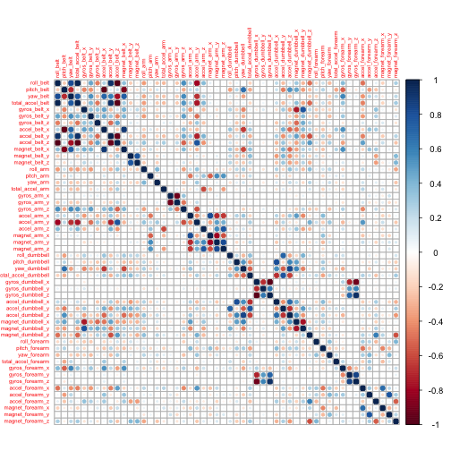
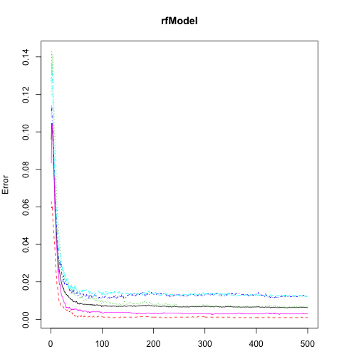

Title
========================================================

Exploring data : Spotting problems using graphics and visualization : Visually checking distributions for a single variable 
Title: Plotting a histogram 


```r
library(ggplot2)
```


```r
load("data/exampleData.rdata")
```


```r
ggplot(custdata) + geom_histogram(aes(x= age), 
                                  binwidth=5, fill="gray")
```

 

Producing a density plot 


scales package brings in the dollar scale notation.

```r
library(scales)
```


```r
ggplot(custdata) + geom_density(aes(x=income)) +
         scale_x_continuous(labels=dollar)
```

 


Title: Creating a log-scaled density plot 


```r
ggplot(custdata) + geom_density(aes(x=income)) +
  scale_x_log10(breaks=c(100, 1000, 10000, 100000), labels=dollar) +
  annotation_logticks(sides="bt")
```

```
## Warning: NaNs produced
## Warning: Removed 79 rows containing non-finite values (stat_density).
```

 


```r
ggplot(custdata) + geom_bar(aes(x=marital.stat), fill = "grey")
```

 


# Title: Producing a horizontal bar chart 


```r
ggplot(custdata) + 
  geom_bar(aes(x=state.of.res), fill = "gray") + 
  coord_flip() + 
  theme(axis.text.y = element_text(size=rel(0.8))) # Note
```

 

```r
#note
#   Reduce the size of the y-axis tick 
#   labels to 80% of default size for legibility. 
```


# Title: Producing a bar chart with sorted categories 


```r
statesums  <- table(custdata$state.of.res)
```
The table() command aggregates the data by state of residence—exactly the information the bar  chart plots.


```r
statef  <- as.data.frame(statesums); head(statef)
```

```
##         Var1 Freq
## 1    Alabama   12
## 2     Alaska    2
## 3    Arizona   12
## 4   Arkansas   13
## 5 California  114
## 6   Colorado   10
```
Convert the table to a data frame. The default column names are Var1 and Freq.

Rename the columns for readability

```r
colnames(statef)  <- c("state.of.res", "count")
head(statef)
```

```
##   state.of.res count
## 1      Alabama    12
## 2       Alaska     2
## 3      Arizona    12
## 4     Arkansas    13
## 5   California   114
## 6     Colorado    10
```


```r
summary(statef)
```

```
##      state.of.res     count       
##  Alabama   : 1    Min.   :  1.00  
##  Alaska    : 1    1st Qu.:  5.25  
##  Arizona   : 1    Median : 12.50  
##  Arkansas  : 1    Mean   : 20.00  
##  California: 1    3rd Qu.: 24.50  
##  Colorado  : 1    Max.   :114.00  
##  (Other)   :44
```
#   Notice that the default ordering for the 
#   state.of.res variable is alphabetical. 


```r
statef  <- transform(statef, 
                     state.of.res=reorder(state.of.res, count))
```

#   Use the reorder() function to set the 
#   state.of.res variable to be count ordered. Use the transform() function 
#   to apply the transformation to the state.of.res data frame. 


```r
summary(statef)
```

```
##        state.of.res     count       
##  South Dakota: 1    Min.   :  1.00  
##  Vermont     : 1    1st Qu.:  5.25  
##  Alaska      : 1    Median : 12.50  
##  Hawaii      : 1    Mean   : 20.00  
##  Rhode Island: 1    3rd Qu.: 24.50  
##  Idaho       : 1    Max.   :114.00  
##  (Other)     :44
```

#   The state.of.res variable is now count 
#   ordered. 


```r
ggplot(statef) + geom_bar(aes(x=state.of.res, y = count))
```

 

#   Since the data is being passed to 
#   geom_bar pre-aggregated, specify both the x and 
#   y variables, and use stat="identity" to plot the 
#   data exactly as given. 

```r
ggplot(statef) + geom_bar(aes(x=state.of.res, y = count),
                          stat = "identity")
```

 
  

```r
ggplot(statef) + geom_bar(aes(x=state.of.res, y = count),
                          stat = "identity",
                          fill="gray")
```

 


```r
ggplot(statef) + geom_bar(aes(x=state.of.res, y = count),
                          stat = "identity",
                          fill="gray") +
  coord_flip()
```

 


```r
ggplot(statef) + geom_bar(aes(x=state.of.res, y = count),
                          stat = "identity",
                          fill="gray") +
  coord_flip() + 
  theme(axis.text.y = element_text(size=rel(0.8)))
```

 


# Producing a line plot
-----------


```r
x  <- runif(100)
y  <- x^2 + 0.2 * x
str(x)
```

```
##  num [1:100] 0.0844 0.8817 0.2482 0.8703 0.3613 ...
```


#   The x variable is uniformly randomly distributed 
#   between 0 and 1. 


```r
ggplot(data.frame(x = x, y = y), aes(x=x, y=y)) + geom_line()
```

 


Title: Examining the correlation between age and income 


```r
custdata2  <- subset(custdata,
                     (custdata$age > 0 & custdata$age < 100
                      & custdata$income > 0))
```


```r
cor(custdata2$age, custdata2$income)
```

```
## [1] -0.02241
```


Visually checking relationships between two variables


```r
ggplot(custdata2, aes(x=age, y=income)) +
  geom_point()
```

 


```r
ggplot(custdata2, aes(x=age, y=income)) +
  geom_point() +
  ylim(0, 200000)
```

```
## Warning: Removed 32 rows containing missing values (geom_point).
```

 


stat_smooth - aids the eye in seeing patternn in case of overlapping.

```r
ggplot(custdata2, aes(x=age, y=income)) + geom_point() +
  stat_smooth(method="lm") +
  ylim(0,200000)
```

```
## Warning: Removed 32 rows containing missing values (stat_smooth).
## Warning: Removed 32 rows containing missing values (geom_point).
```

 

geom_smooth: add a smoothed conditional mean

```r
ggplot(custdata2, aes(x=age, y=income)) +
  geom_point() +
  geom_smooth() +
  ylim(0,200000)
```

```
## geom_smooth: method="auto" and size of largest group is <1000, so using loess. Use 'method = x' to change the smoothing method.
```

```
## Warning: Removed 32 rows containing missing values (stat_smooth).
## Warning: Removed 32 rows containing missing values (geom_point).
```

 


# Title: Plotting the distribution of health.ins as a function of age 


```r
ggplot(custdata2, aes(x=age, y = as.numeric(health.ins))) +
  geom_point()
```

 
#   The Boolean variable health.ins must be 
#   converted to a 0/1 variable using as.numeric. 


```r
ggplot(custdata2, aes(x=age, y = as.numeric(health.ins))) +
  geom_point(position=position_jitter(w=0.5, h=0.5))
```

 
#   Since y values can 
#   only be 0 or 1, add a small jitter to get a sense of data 
#   density. 


```r
ggplot(custdata2, aes(x=age, y = as.numeric(health.ins))) +
  geom_point(position=position_jitter(w=0.5, h=0.5)) +
  geom_smooth()
```

```
## geom_smooth: method="auto" and size of largest group is <1000, so using loess. Use 'method = x' to change the smoothing method.
```

 
#   Add smoothing curve. 
